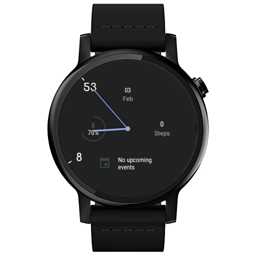
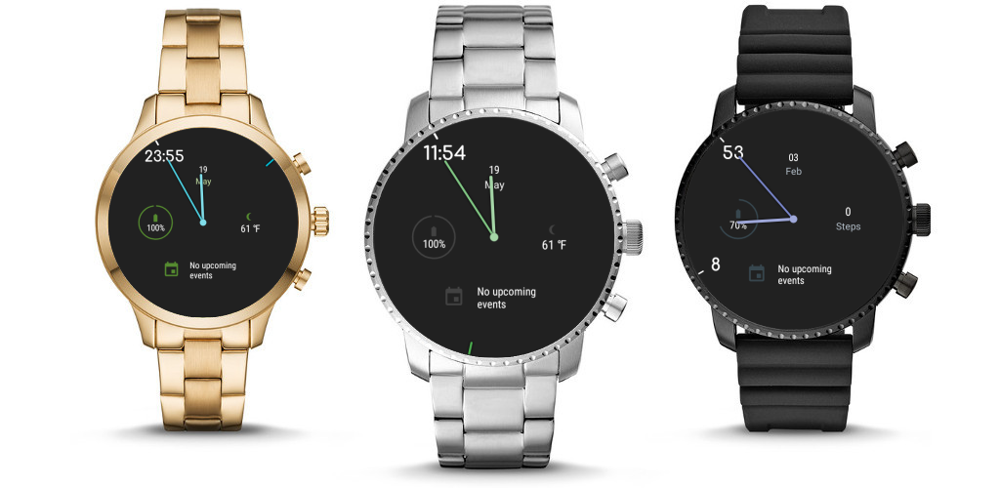
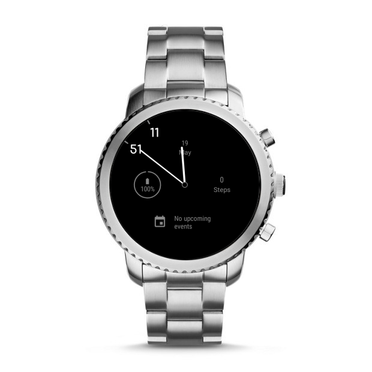

# Minimalin Watch Face

A simple minimalistic watch face for Wear OS, set in a material design

Minimalin is a customizable minimalistic watch face inspired by the [Minimalin watch](https://github.com/GringerApps/minimalin) face for [Pebble](https://apps.rebble.io/en_US/application/56f93a5361a01637e5000036?section=watchfaces) with features added for Wear OS.

## Features

* Material Color Theme
* Fully customizable Complications
* Ambient mode
* Smart notification Complication (only show notifications if there are any)
* 24/48 hour mode
* Open Source!

## [Screenshots](art/screenshots/)

